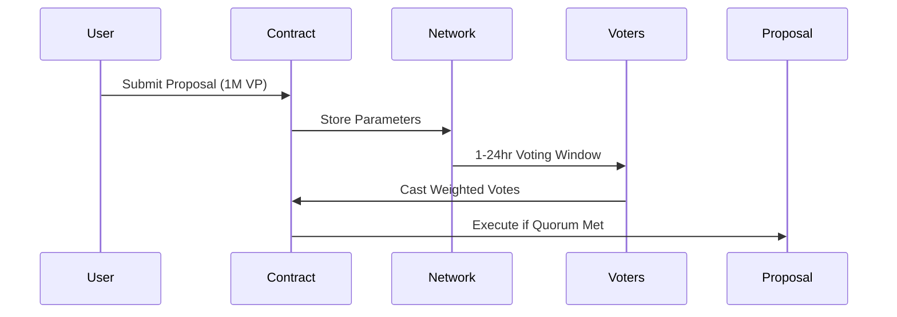

# 🟧 Bitcoin Stackchain: Staking & Governance Protocol

A decentralized protocol for staking STX tokens with tiered rewards and on-chain governance. Built on the Stacks Layer 2 network and secured by Bitcoin, it combines DeFi mechanics with trustless governance in a smart-contract-controlled environment.

---

## 🚀 Overview

**Bitcoin Stackchain** enables:

- STX staking with optional lock periods and dynamic reward multipliers
- Tier-based progression system unlocking enhanced benefits
- Fully on-chain proposal creation and stake-weighted voting
- Anchored finality and tamper-resistance via Bitcoin

All interactions occur through Clarity smart contracts on the Stacks blockchain, ensuring transparency and security.

## 🌟 Key Features

### 🏅 Tiered Staking System
| Tier   | Minimum STX | Rewards Multiplier | Governance Features          |
|--------|-------------|--------------------|------------------------------|
| Bronze | 1+          | 1x                 | Basic voting rights          |
| Silver | 5+          | 1.5x               | Proposal creation            |
| Gold   | 10+         | 2x                 | Advanced governance controls |

+ **Time-Locked Bonuses**: Up to 1.5x multiplier for 60-day locks
+ **Auto-Compounding**: Rewards automatically reinvested during lock periods

### 🗳️ Baton Governance Engine

- Dynamic quorum based on circulating supply
- STX-weighted voting with tier multipliers
- On-chain proposal execution via Clarity

---

## ⚙️ Technical Architecture

### Core Components
```
+---------------------+
| Bitcoin Base Layer  |
| (Transaction Finality)|
+----------+----------+
           ↓
+---------------------+
| Stacks Layer 2      |
| (Smart Contracts)   |
+----------+----------+
           ↓
+---------------------+
| Stackchain Protocol |
| - Staking Engine    |
| - Governance Module |
| - Reward Distributor|
| - Risk Management   |
+---------------------+
```

### Smart Contract Structure
```clarity
(define-map UserPositions
  principal
  {
    stx-staked: uint,
    lock-duration: uint,
    voting-power: uint,
    tier: { bronze: 1, silver: 5, gold: 10 }
  }
)
```

---

## 🔐 Security Framework

### Bitcoin-Anchored Protections
- All transactions finalized via Bitcoin blocks
- STX transfers use Bitcoin's UTXO model
- 24-hour withdrawal cooldown (1,440 blocks)

### Risk Mitigations
```clarity
(define-read-only (calculate-voting-power (user principal))
  (let 
    ((position (map-get? UserPositions user)))
    (* 
      (get stx-staked position)
      (get tier-multiplier position)
      (get lock-bonus position)
    )
  )
)
```
- Circuit breaker with contract pause functionality
- Input validation for all user parameters
- Tier-based access controls for governance actions

---

## 📜 Governance Parameters

| Parameter          | Requirement          |
|--------------------|----------------------|
| Minimum Proposal VP| 1M microSTX (1 STX) |
| Voting Period      | 100-2880 blocks      |
| Execution Threshold| 1M votes             |
| Quorum Adjustment  | Dynamic supply-based |

---

## ⚠️ Audit Status & Dependencies

### Security Notice
```clarity
;; WARNING: EXAMPLE CODE - NOT AUDITED
(define-public (emergency-pause)
  (asserts! (is-eq tx-sender contract-owner) ERR_UNAUTHORIZED)
  (var-set contract-paused true)
  (ok true)
)
```
- **This implementation contains unaudited example code**
- Professional security review required before production use

### Core Dependencies
- Clarity Language v2.1+
- Stacks Blockchain v3.0+
- Bitcoin Core consensus rules
